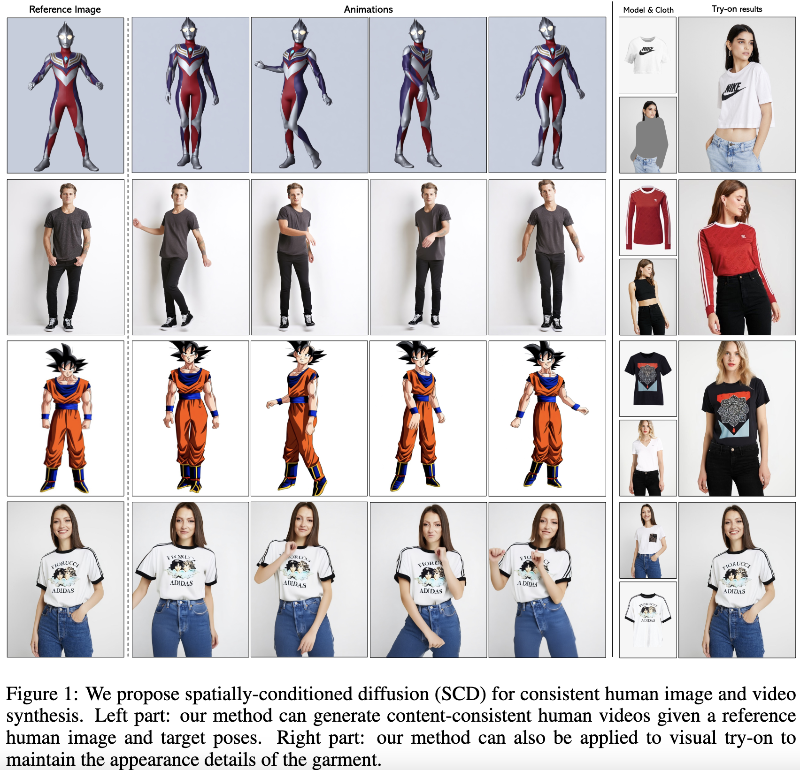
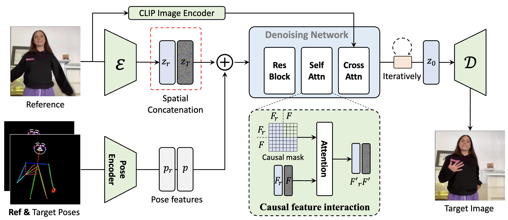
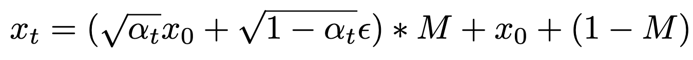

## Consistent Human Image and Video Generation with Spatially Conditioned Diffusion

[Mingdeng Cao](https://github.com/ljzycmd),
[Chong Mou](https://scholar.google.com/citations?user=SYQoDk0AAAAJ),
[Ziyang Yuan](https://scholar.google.com/citations?user=fWxWEzsAAAAJ),
[Xintao Wang](https://xinntao.github.io/),
[Zhaoyang Zhang](https://zzyfd.github.io/),
[Ying Shan](https://scholar.google.com/citations?user=4oXBp9UAAAAJ),
[Yinqiang Zheng](https://scholar.google.com/citations?user=JD-5DKcAAAAJ)

> In this paper, we explore the generation of consistent human-centric visual content through a spatial conditioning strategy. We frame consistent reference-based controllable human image and video synthesis as a spatial inpainting task, where the desired content is spatially inpainted under the conditioning of a reference human image. Additionally, we propose a causal spatial conditioning strategy that constrains the interaction between reference and target features causally, thereby preserving the appearance information of the reference images for enhanced consistency. By leveraging the inherent capabilities of the denoising network for appearance detail extraction and conditioned generation, our approach is both straightforward and effective in maintaining fine-grained appearance details and the identity of the reference human image.

## Main Architecture

Core idea: Utilizing the denoising U-Net for reference feature extraction and target image synthesis to ensure content consistency.

## Results of Human Animation

Trained with the TikTok dataset (350 videos), UBCFashion (500 videos), and a self-gathered dance video dataset (3,500 dance videos featuring about 200 humans).

## More Applications

Our method can also be applied to the visual try-on task to generate garment-consistent human images. During training, we only add noise to the garment region in the human image:

Correspondingly, a regional loss is applied to the denoising U-Net's prediction during loss calculation. The results of the model trained on VTON-HD dataset: 

<i>Paired setting</i>

<i>Unpaired setting</i>

## Contact

If you have any comments or questions, please feel free to contact [Mingdeng Cao](https://github.com/ljzycmd).
